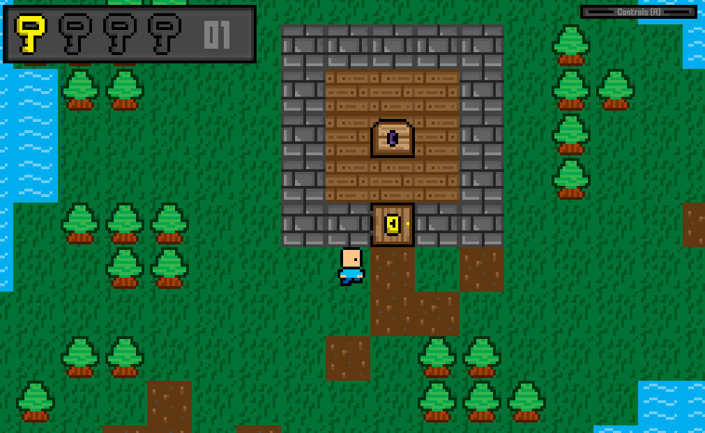

# KeyFinder - Key hunting game 

## About the Project

KeyFinder was a game that I created with Java back during the end of 2022 and during the start of 2023. The project took approximately 3 months to fully complete due to a busy school schedule, but in March of 2023 I made the last official changes.

Towards the end of the project, while conversing with my Computer Programming 12 instructor, he suggested that I submit this project not only as a final project for his course, but also to the District Authority for the chance of winning $1250. After some anxious waiting, I heard back from the District Authority with good news. KeyFinder and its documentation had secured me the scholarship!

The creation of this game was an exercise in object-oriented design as well as a test of my knowledge of programming concepts such as recursion.

## Readme Contents

- [General info](#general-info)
  - [How to Run](#How-to-Run)
  - [What to do](#what-to-do)
- [Technologies](#technologies)
- [Contents](#contents)

## General Info

### How to Run

This is very easy! So long as you have Java installed, simply download this folder and run the [provided jar](./2DJavaGame%20SUBMISSION-SC.jar) file give the name '2DJavaGame SUBMISSION-SC.jar'

This is what that might look like inside of your downloaded folder:


Enjoy!

*Java is required to be able to run this project. Download java from [here](https://www.java.com/en/download/).*

<hr></hr>

### What to do

In the KeyFinder game you are the key finder, a character who must collect keys to open locked doors and access the final purple chest of each level. There are four levels in total each containing three to four different keys. 


To control the player, simply use the WASD keys. The player has the ability to sprint, this can be done by pressing the space key while moving. At anytime, the game can be quit by pressing the escape key. 
To see these controls ingame, press the 'r' key.


The levels are labrynthian in nature, inspired by the old-school gameplay to be found in titles such as Wolfenstein and Doom.
Unfortunately, there are no enemies to defeat in KeyFinder, the only contest is the one going on inside your mind as you navigate the levels eagerly seaking keys.



Once you reach the final level and unlock the last chest , you will have successfully completed the game. Congratulations! From here you are free to play again by pressing 'enter' or quit the game by pressing the 'esc' key.

*If you want more information, feel free to read the documentation that I wrote for this game [here](./KeyFinder%20Design%20Document.pdf).*

<hr></hr>

### Adding A Level

One of the purposes of this project was to successfully implement an object oriented paradigm. Being that this was the case, one of my goals was to make the addition of levels easier! Let's do that now.

First thing is first, we need to create a txt file that tells the game exactly what tiles to draw. This is determined by scanning the contents of a text file using the Scanner class, tiles are delimited by white space. The lengths of each row and column must be the same (rectangular), you cannot have any weird shaped maps because the tile manager class was created to read rectangular maps.


Next, this file should be of the format .txt and inside it should contain numbers between 0-8. These numbers correspond to the type of tile that you want to draw at a given position.


Your map should end up looking something like this. Keep in mind that collisions happen on water tiles 2, 3, 5, 6, 7.


## Technologies

- Java
- BeepBox (for the music)

## Contents

```
Top Level of Project:
├── githubstuff                                          # Folder containing GitHub related information
├── res                                                  # Folder containing graphics
├── src                                                  # Folder containing source code
├── 2DJavaGame SUBMISSIOn-SC.jar                         # Executable jar file
├── InstructorFeedback.pdf                               # Instructors feedback
├── KeyFinder Design Document.pdf                        # Documentation
├── NOTE.txt                                             # Note for scholarship committee
└── README.md                                            # This!

res contents:
├── UI                                                   # Folder containing UI graphics
|
└────| Text                                                    # Folder containing fonts
|    |
|    └───── ARCADECLASSIC.TTF                                        # ttf font used
|    └───── FFFFORWA.TTF                                             # ttf font
|    └───── pizzadudedotdk.txt                                       # ttf font
|    └───── read_me.txt                                              # Read me text file copntaining font license
|
└───── Key.png                                                 # Blank key image
└───── KeyFinderUI.png                                         # Key image container
└───── KeyFinderUI.psd                                         # psd for key image container
└───── ShowBoxClosed.png                                       # Controls container closed
└───── ShowBoxClosed.psd                                       # psd for controls container closed
└───── ShowBoxOpen.png                                         # Controls container opened
└───── SpeedIcon.png                                           # Sprint icon
|
├── maps                                                 # Folder containing map text data
|
└───── testMap.txt                                             # Map created for testing purposes
└───── world01.txt                                             # Map #1
└───── world02.txt                                             # Map #2
└───── world03.txt                                             # Map #3
└───── world04.txt                                             # Map #4
|
├── objects                                              # Folder containing object graphics
|
└───── Data                                                    # Folder containing photoshop psd files
└───── B_Door.png                                              # Blue door graphic
└───── B_Key.png                                               # Blue key graphic
└───── Bullet.png                                              # Unused asset
└───── ChestClosed.png                                         # Chest closed graphic
└───── ChestOpen.png                                           # Chest open graphic
└───── Door.png                                                # Door closed graphic
└───── DoorOpened.png                                          # Door opened graphic
└───── Key.png                                                 # Gray key (blank template)
└───── P_ChestClosed.png                                       # End chest closed graphic
└───── P_Key.png                                               # Purple key graphic
└───── R_Door.png                                              # Red door graphic
└───── R_Key.png                                               # Red key graphic
└───── Y_Door.png                                              # Yellow door graphic
└───── Y_Key.png                                               # Yellow key graphic
|
├── player/movement                                      # Folder containing player graphics
|
└───── Player_D1.png                                           # Player down sprite 1
└───── Player_D2.png                                           # Player down sprite 2
└───── Player_IDL.png                                          # Player idle sprite
└───── Player_L1.png                                           # Player left sprite 1
└───── Player_L2.png                                           # Player left sprite 2
└───── Player_R1.png                                           # Player right sprite 1
└───── Player_R2.png                                           # Player right sprite 2
└───── Player_U1.png                                           # Player up sprite 1
└───── Player_U2.png                                           # Player up sprite 2
|
├── sound                                                # Folder containing sound
|
└───── ORG                                                     # Origional ogg files
└───── DoorOpen.wav                                            # Door open sound
└───── EndLevel.wav                                            # End level wav sound effect
└───── Error.wav                                               # Error sound effect
└───── FoorSteps.wav                                           # Footsteps sound effect
└───── Key.wav                                                 # Key pickup sound effect
└───── MenuSong.wav                                            # Called menu wav, but it's actually the song that plays at the end of the game
└───── note.txt                                                # Contains information about the music creation
|
└── tiles                                                # Folder containing tile graphcis
|
└───── data                                                    # Folder containing psd documents for tile graphics
└───── BannerWall.png                                          # Banner wall png graphic
└───── Dirt.png                                                # Dirt png graphic
└───── Grass.png                                               # Grass png graphic
└───── KnightStatue.png                                        # Knight statue png graphic
└───── Lilypad.png                                             # Lilypad on water png graphic
└───── Tree.png                                                # Tree png graphic
└───── Wall.png                                                # Stone wall png graphic
└───── Water.png                                               # Water png graphic
└───── Wood.png                                                # Wood floor png graphic
└───── bound.png                                               # Out-of-bounds png graphic

src content:
├── 1-OXPS                                               # Folder containing build process artifacts
├── entity                                               # Folder containing java classes for entities
|
└───── Entity.java                                             # Code for an entity
└───── Player.java                                             # Code for the player entity
|
├── main                                                 # Folder containing java classes for game's core
|
└───── CollisionDetection.java                                 # Code for collision detection
└───── GamePanel.java                                          # CORE of the game
└───── KeyHandler.java                                         # Code for input handling
└───── Main.java                                               # Drives the program :)
└───── Sound.java                                              # Code for handling the playing of sound
└───── UI.java                                                 # Code for handling the state of the UI
|
├── map                                                  # Folder containing java classes for maps
|
└───── Map.java                                                # Base map code. Renders objects (based on current map).
└───── TestMap.java                                            # Code for the test map
└───── World01.java                                            # Code for map #1
└───── World02.java                                            # Code for map #2
└───── World03.java                                            # Code for map #3
└───── World04.java                                            # Code for map #4
|
├── object                                               # Folder containing java classes for objects
|
└───── Tile.java                                               # Base tile code
└───── TileManager.java                                        # Code for the awesome tile manager
|
└── tile                                                 # Folder containing java classes for tiles


```

<br/><br/>
